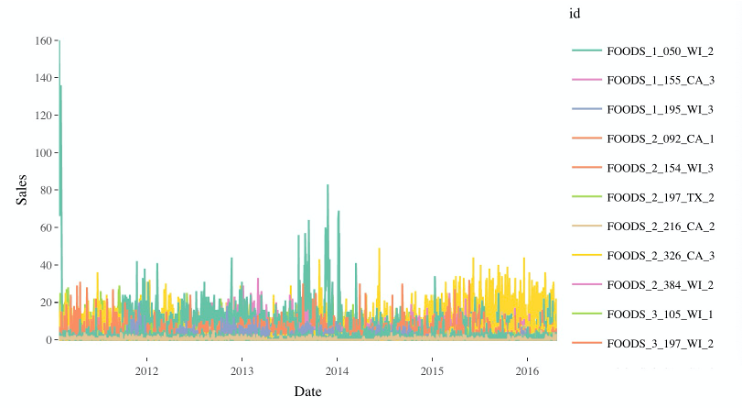
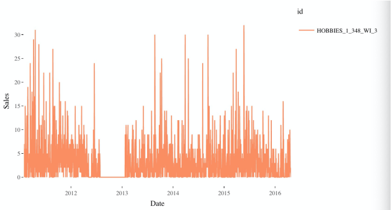
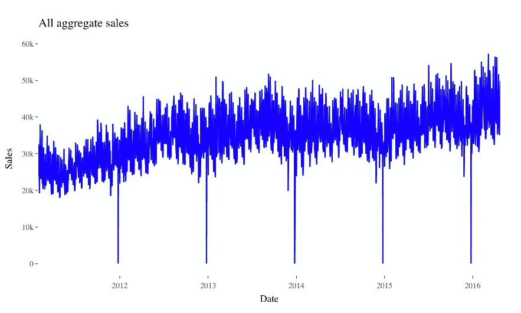
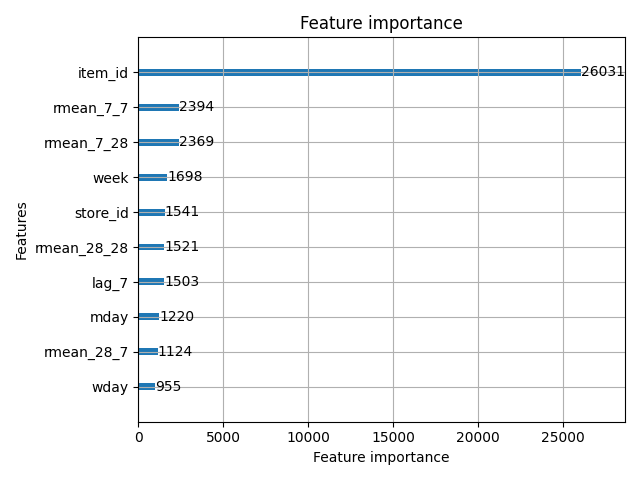
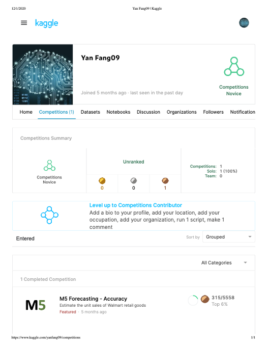

# Sales-Prediction-Accuracy M5 Forecasting - Accuracy

code for Kaggle [M5 Forecasting - Accuracy] (https://www.kaggle.com/c/m5-forecasting-accuracy)

A ensemble method of lightGBM and NN model is adopted: 0.7*lgbm +0.3*(lstm+cnn epoch3) 
For lightgbm, according to data provided by the organizer, we custom lag-7 and lag-28 and their mean featu which is pretty helpful for the prediction.
For the NN model, we use layers combination of LSTM for remember history features, and 1-D CNN to capture neibougher features. 

Result: Bronze Medal, top 6% ranking 315/5558 in final private leaderboard.

## EDA

General exploratory data analysis for the time series data among 5 years.



Random id choosed time series data plot.



Aggregate Sales plot.



More detailed EDA credit to [Kaggle Competition Notebook] (https://www.kaggle.com/headsortails/back-to-predict-the-future-interactive-m5-eda)

## LightBGM Model

Run ```python lgbmodel.py``` 
Will get the result in submission_lgbm.csv

Results of feature importance.



## NN(LSTM+CNN) Model

First preprocess train-test data, run ```python make_train_test_data.py```
After get the data prepared, run ```python m5_full_train.py```
Will get the result in submission_lstmcnn.csv

## Ensemble
Run ```python test2.py``` 
Will get final submission which we submit in the competition.

## Competition Results
Results of Competition.



